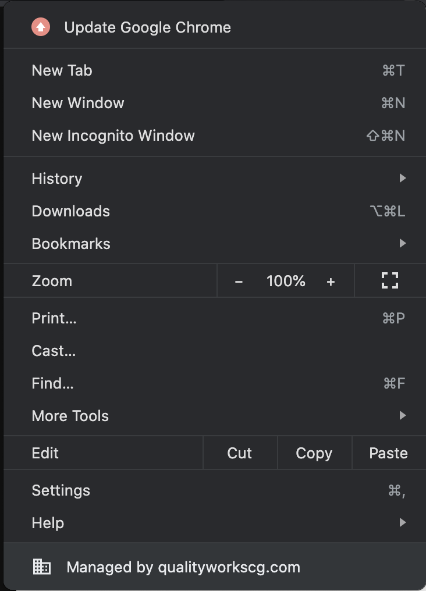

# Intervals Helper

This extension is designed to help time management in intervals.

## Running it locally

### `npm install`

Installs the dependencies and creates the node modules folder. 

### `npm run build`

Builds the app for production to the `build` folder. 
It correctly bundles React in production mode and optimizes the build for the best performance.

The build is minified and the filenames include the hashes. 
Your app is ready to be deployed!

### Adding the extension to Google Chrome

Open the google chrome settings dropdown.

