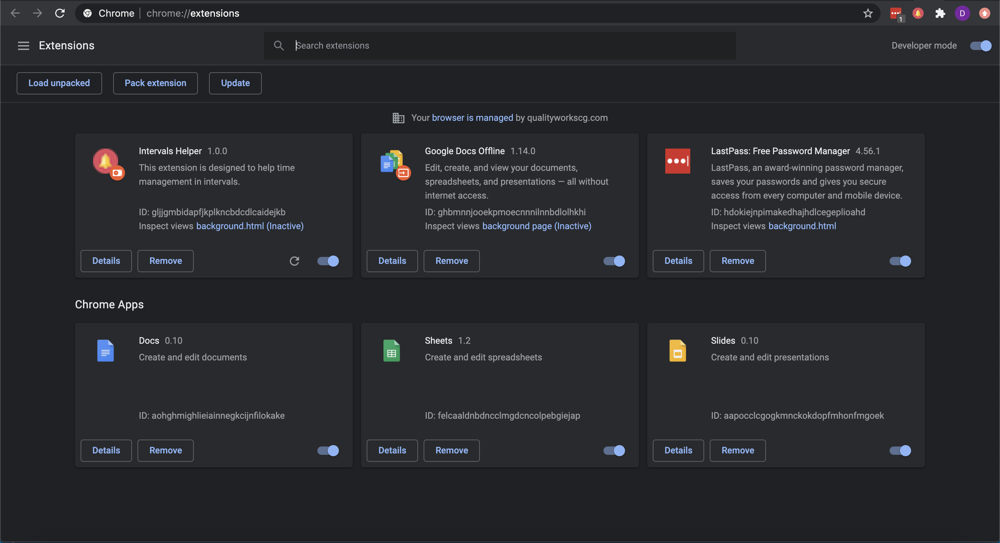

# Intervals Helper

This extension is designed to help time management in intervals.

## Running it locally

### `npm install`

Installs the dependencies and creates the node modules folder. 

### `npm run build`

Builds the app for production to the `build` folder. 
It correctly bundles React in production mode and optimizes the build for the best performance.

The build is minified and the filenames include the hashes. 

### Adding the extension to Google Chrome

Open the google chrome settings dropdown. 
  

Select the "More Tools" option and open the Extensions Window. From here, you'll have to enable `Developer Mode` and click the Load Unpacked Button. This will open a window and from here you'll select the name of the directory to which the application was built (`build` folder) 

